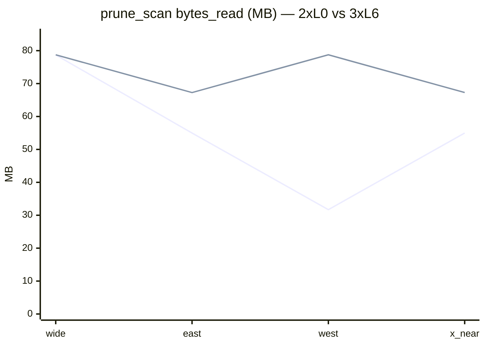
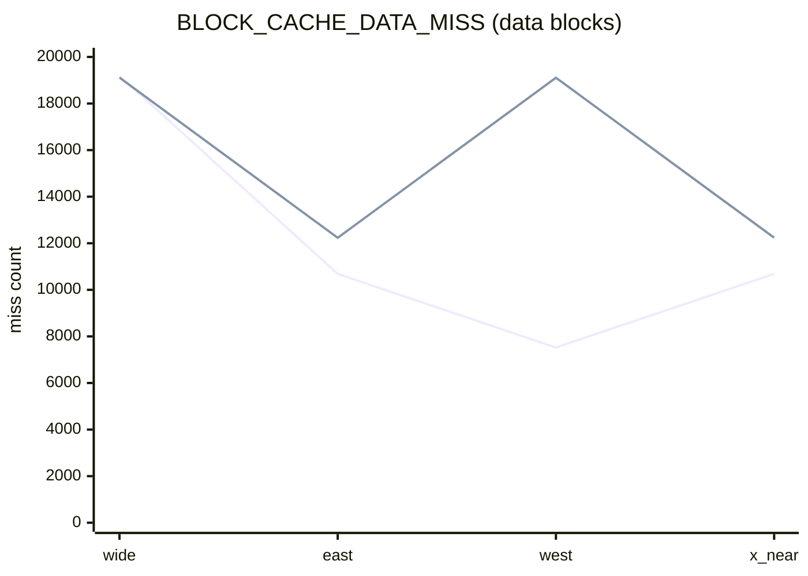

# ST 剪枝有效性：汇总表与读图说明

数据来自 **`st_validity_sweep.ps1`**（`--no-full-scan`）及 **`Record.md`**（2026-04-06 各节）。**`bytes_read`** 为 IOStats 增量；**MB** = `bytes_read / 10^6`。

**空间分布 + MBR + 东西向查询矩阵**：见同目录 **`st_validity_spatial.png`**（由 **`tools/plot_st_validity_spatial.py`** 从 **`data/processed/segments_points.csv`** 与 **`tools/st_validity_experiment_windows.csv`** 生成；SST 文件级 MBR 为 **`verify_traj_st_full`** 两 L0 文件的 **`st_file_bounds`**，见 **`Record.md`**）。

---

## 1. 主表：12 窗 × 两库（核心指标）

| 窗 `label` | 库 | `prune_scan keys` | `block_read` | `bytes_read` (B) | **≈ MB** | `BLOCK_CACHE_DATA_MISS` |
|------------|-----|-------------------|--------------|-------------------|----------|---------------------------|
| wide_baseline | 2×L0 full | 3803 | 5 | 78704054 | **78.70** | 19193 |
| wide_baseline | 3×L6 compact | 3804 | 9 | 78737063 | **78.74** | 19112 |
| sharp_spatiotemporal | 2×L0 | 26 | 5 | 78704054 | **78.70** | 19193 |
| sharp_spatiotemporal | 3×L6 | 27 | 9 | 78737063 | **78.74** | 19111 |
| east_x_file_disjoint | 2×L0 | 1 | 902 | 54975545 | **54.98** | 10684 |
| east_x_file_disjoint | 3×L6 | 3 | 4618 | 67269463 | **67.27** | 12234 |
| west_x_both_intersect | 2×L0 | 2 | 1736 | 31697143 | **31.70** | 7524 |
| west_x_both_intersect | 3×L6 | 3 | 9 | 78737063 | **78.74** | 19110 |
| x_near_119_boundary | 2×L0 | 2 | 903 | 54979627 | **54.98** | 10685 |
| x_near_119_boundary | 3×L6 | 3 | 4616 | 67277657 | **67.28** | 12238 |
| tight_y_band | 2×L0 | 111 | 5 | 78704054 | **78.70** | 19193 |
| tight_y_band | 3×L6 | 112 | 9 | 78737063 | **78.74** | 19111 |
| early_t_slice | 2×L0 | 2 | 5 | 78704054 | **78.70** | 19193 |
| early_t_slice | 3×L6 | 3 | 9 | 78737063 | **78.74** | 19111 |
| mid_t_slice | 2×L0 | 2 | 5 | 78704054 | **78.70** | 19193 |
| mid_t_slice | 3×L6 | 3 | 9 | 78737063 | **78.74** | 19111 |
| late_t_slice | 2×L0 | 4011 | 7 | 78724426 | **78.72** | 19181 |
| late_t_slice | 3×L6 | 4012 | 9 | 78737063 | **78.74** | 19111 |
| south_y_shift | 2×L0 | 2 | 5 | 78704054 | **78.70** | 19193 |
| south_y_shift | 3×L6 | 3 | 9 | 78737063 | **78.74** | 19111 |
| north_y_shift | 2×L0 | 2 | 5 | 78704054 | **78.70** | 19190 |
| north_y_shift | 3×L6 | 3 | 9 | 78737063 | **78.74** | 19111 |
| micro_box | 2×L0 | 2 | 11 | 78765300 | **78.77** | 19150 |
| micro_box | 3×L6 | 3 | 9 | 78737063 | **78.74** | 19110 |

**读表要点**

- **相对宽窗的 IO**：**东向 / 近 119°** 在两库上 **`bytes_read` 均低于宽窗**；**西向** 仅在 **2×L0** 上 **大幅低于宽窗**，在 **3×L6** 上与 **宽窗几乎相同**（与 **compact + west diag** 一致：`would keep≈19110`）。
- **`keys`**：**块内过滤** 后多为 **个位数～千级**；**wide** 约 **3803/3804** 为「窗内点数」量级。

---

## 2. 相对宽窗：`bytes_read` 变化（叙事用）

以 **wide_baseline** 为 100%，**节省比例 ≈ 1 − MB/78.70**（2×L0 宽窗 MB）。

| 窗 | 2×L0 **≈MB** | 相对宽窗 | 3×L6 **≈MB** | 相对宽窗 |
|----|--------------|----------|--------------|----------|
| wide_baseline | 78.70 | 0% | 78.74 | 0% |
| east_x_file_disjoint | 54.98 | **−30%** | 67.27 | **−15%** |
| west_x_both_intersect | 31.70 | **−60%** | 78.74 | **0%** |
| x_near_119_boundary | 54.98 | **−30%** | 67.28 | **−15%** |

---

## 3. 图 A：`bytes_read`（MB）— 四代表窗 × 两库

在支持 **Mermaid** 的预览中渲染（如 VS Code / Cursor Markdown 预览、GitHub）。

---

## 4. 图 B：同一四窗 — **`BLOCK_CACHE_DATA_MISS`**

**解读**：**east / x_near** 两库 **`data_miss` 均低于 wide**；**west** 在 **2×L0** 上 **7524**，在 **3×L6** 上 **≈19110**（与 **wide** 同量级），与 **diag「仅 3 块 disjoint」** 一致。

---

## 5. 效果是否「够」、是否继续实验

**已足够支撑的结论（写论文 / 答辩）**

1. **Manifest / 文件级**：**东向窗** + **2×L0** → **`bytes` 与 `data_miss` 大幅下降**（**`000011` DISJOINT**），机制清晰。  
2. **SST index 块级**：**西向 / 近 119°** + **2×L0** → **块级大量 skip**，**`data_miss` 与 diag `would keep` 一致**。  
3. **块内 key**：**wide vs sharp** **`bytes` 同、`keys` 差两个数量级**，语义与测量一致。  
4. **布局敏感性**：**同一西向窗**，**2×L0 vs 3×L6** **IO 差异巨大**，有 **compact+west diag** 闭环。

**若仍显单薄、可加的轻量实验（非必须）**

- **east + compact** 三 SST **`st_meta_sst_diag`**，与 **E2 东向行** 对齐。  
- **固定缓存协议** 下对 **四代表窗** 再跑一轮（仅增强可重复叙述）。  
- **更大数据 / 更多窗**（论文 **§1.1** 终极目标）—— 留待后续阶段。

**更直观的图**：同目录下 **`st_validity_charts.html`** 用浏览器打开，可看 **柱状对比**（无需 Mermaid）。

---

*维护：若重跑 sweep 更新数字，请同步修改本页与 `st_validity_charts.html` 内嵌数据。*
