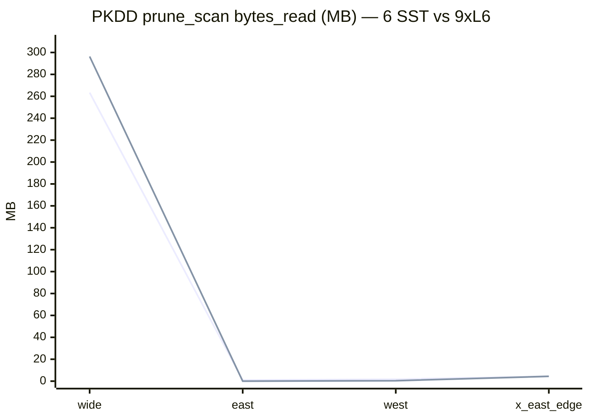
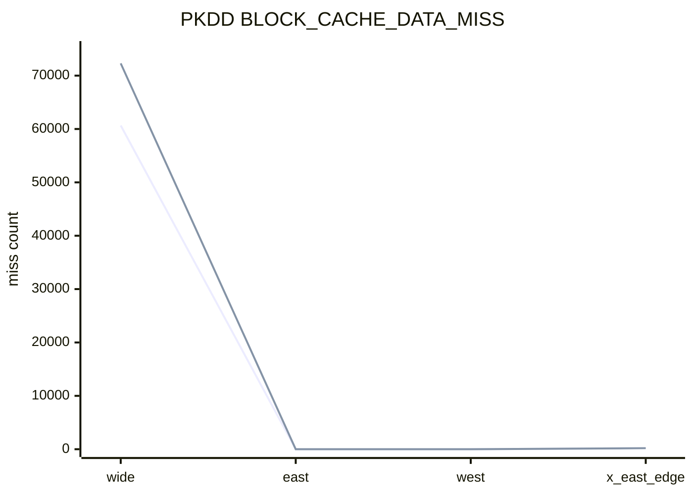

# PKDD（Porto）ST 剪枝有效性：汇总表与读图说明

数据来自 **`data/experiments/validity_sweep_pkdd_e2_two_dbs.tsv`**（`st_validity_sweep.ps1` + **`tools/st_validity_experiment_windows_pkdd.csv`**），**`st_meta_read_bench --no-full-scan`**。**MB** = `bytes_read / 10^6`。

**柱状图（浏览器）**：同目录 **`st_validity_charts_pkdd.html`**。

---

## 1. 主表：12 窗 × 两库

| 窗 `label` | 库 | `keys` | `block_read` | `bytes_read` (B) | **≈ MB** | `BLOCK_CACHE_DATA_MISS` |
|------------|-----|--------|--------------|------------------|----------|-------------------------|
| wide_baseline | verify_pkdd_st（6 SST） | 3466181 | 1563 | 263348679 | **263.35** | 60653 |
| wide_baseline | verify_pkdd_compact_work（9×L6） | 3466181 | 27 | 296344182 | **296.34** | 72295 |
| sharp_spatiotemporal | verify_pkdd_st | 82 | 3548 | 212649769 | **212.65** | 44880 |
| sharp_spatiotemporal | verify_pkdd_compact_work | 87 | 7080 | 276941463 | **276.94** | 54780 |
| east_x_file_disjoint | verify_pkdd_st | 0 | 2 | 926186 | **0.93** | 0 |
| east_x_file_disjoint | verify_pkdd_compact_work | 0 | 0 | 0 | **0.00** | 0 |
| west_x_both_intersect | verify_pkdd_st | 1 | 4 | 1747819 | **1.75** | 1 |
| west_x_both_intersect | verify_pkdd_compact_work | 1 | 2 | 412569 | **0.41** | 1 |
| tight_y_band | verify_pkdd_st | 28079 | 8444 | 244975994 | **244.98** | 46061 |
| tight_y_band | verify_pkdd_compact_work | 28083 | 6324 | 290735120 | **290.74** | 54845 |
| early_t_slice | verify_pkdd_st | 517001 | 18 | 220669358 | **220.67** | 53392 |
| early_t_slice | verify_pkdd_compact_work | 517005 | 261 | 297733820 | **297.73** | 69153 |
| mid_t_slice | verify_pkdd_st | 504404 | 67 | 220845416 | **220.85** | 53498 |
| mid_t_slice | verify_pkdd_compact_work | 504408 | 27 | 296344182 | **296.34** | 72290 |
| late_t_slice | verify_pkdd_st | 354795 | 548 | 36414077 | **36.41** | 7978 |
| late_t_slice | verify_pkdd_compact_work | 354803 | 571 | 297772131 | **297.77** | 67502 |
| south_y_shift | verify_pkdd_st | 168 | 8120 | 36654628 | **36.65** | 8129 |
| south_y_shift | verify_pkdd_compact_work | 172 | 9264 | 42112063 | **42.11** | 9325 |
| north_y_shift | verify_pkdd_st | 462 | 487 | 5508449 | **5.51** | 481 |
| north_y_shift | verify_pkdd_compact_work | 466 | 617 | 6023682 | **6.02** | 608 |
| x_near_eastern_boundary | verify_pkdd_st | 4 | 205 | 4366532 | **4.37** | 199 |
| x_near_eastern_boundary | verify_pkdd_compact_work | 9 | 208 | 4367947 | **4.37** | 199 |
| micro_box | verify_pkdd_st | 1014 | 1970 | 217587004 | **217.59** | 46556 |
| micro_box | verify_pkdd_compact_work | 1019 | 6498 | 280409401 | **280.41** | 56824 |

**读表要点**

- **东向窗**（数据 lon 以东、与包络不相交）：两库 **`keys=0`**；**`bytes_read`** 原件 **≈0.93MB**、compact **≈0**（文件级全跳过 + 几乎无读块）。相对 **wide** 下降 **>99%**。
- **wide**：**~346 万 keys** 为窗内点数量级；compact 库 **`block_read`** 远小于原件（**27 vs 1563**），但 **`bytes_read`** 因 **多 SST / 缓存未命中** 略高于原件 —— 与 Geolife E2 类似，需结合布局叙述。
- **多样窗**下 **`keys` 分布** 从 **0** 到 **百万级**，非常数。

---

## 2. 相对 wide_baseline：`bytes_read`（按库分别归一）

以各库 **wide_baseline** 为 100%：

| 窗 | 6 SST 原件 **≈MB** | 相对 wide | 9×L6 compact **≈MB** | 相对 wide |
|----|-------------------|-----------|----------------------|-----------|
| wide_baseline | 263.35 | 0% | 296.34 | 0% |
| east_x_file_disjoint | 0.93 | **−99.6%** | 0.00 | **−100%** |
| west_x_both_intersect | 1.75 | **−99.3%** | 0.41 | **−99.9%** |
| x_near_eastern_boundary | 4.37 | **−98.3%** | 4.37 | **−98.5%** |

（西向在本数据上 **窗内仅 1 key**，故 IO 也极低；与 Geolife「西向块级大 skip」数值量级不同，但 **仍体现「几何 + 布局」敏感**。）

---

## 3. 图 A：`bytes_read`（MB）— 四代表窗 × 两库

---

## 4. 图 B：四代表窗 — `BLOCK_CACHE_DATA_MISS`

---

## 5. 与 Geolife 对照（一句话）

同一套 **ST 剪枝读路径** 在 **PKDD/Porto** 上复现：**东向相对宽窗的 IO 断崖**、**多样窗 keys 分布**、**compact 改变 `block_read`/`bytes` 形态**；数值尺度受 **点数（~484 万）与窗内命中** 支配，图表侧重 **趋势** 而非与 Geolife MB 逐字对比。

---

*维护：若重跑 `validity_sweep_pkdd_e2_two_dbs.tsv`，请同步修改本页与 `st_validity_charts_pkdd.html` 内嵌数据。*
